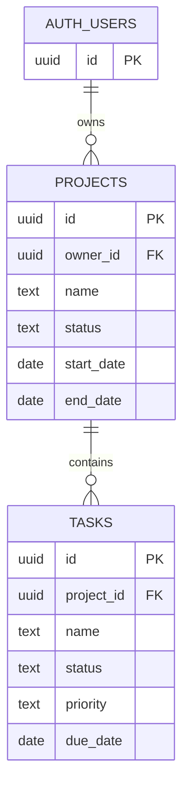

# Daymark

Daymark brings projects, tasks, and deadlines into one calm workspace. It includes a Next.js web app, Expo Go Android app, and an Express API using Supabase Auth and PostgreSQL. Its design combines Minimal Type Gallery with the Taste Skill redesign audit. See [design decisions](docs/DESIGN.md).

Public repository: https://github.com/sammy-ryed/daymark

## Run locally

1. Use Node.js 22 or later. On this machine run `powershell -File scripts/install-dependencies.ps1` to install on D:. On another machine with adequate space, ordinary `npm install` is also supported.
2. The API's ignored `apps/api/.env` is connected to project `mulxqpqzwdrzplnuhddn`. A new environment can copy `apps/api/.env.example` and set its project URL and publishable key. No service-role key is used by the application.
3. Run `npm run dev` from the root. Open http://localhost:3000. The API runs on port 4000. Next.js proxies `/api` to Express. In deployment, set `API_ORIGIN` in the web environment to the Express origin and `WEB_ORIGIN` in Express to the exact public web origin.
4. Run `npm run mobile` in a second terminal. Open the QR code with Android Expo Go compatible with SDK 57. `apps/mobile/.env` points to `http://192.168.1.12:4000/api`; update it when the computer's LAN IP changes. Phone and computer must share a network. A Metro tunnel does not expose the API; use a deployed HTTPS API for remote mobile access.

The web package has a small launcher that preserves module paths across the C:/D: directory junction. Avoid running `npm install` directly in the root on this machine: npm may replace the junction and fill C: again. Use the install script instead. The smaller `.next` folder must remain local; linking it to another drive caused routing failures. Expo's `REACT_NATIVE_PACKAGER_HOSTNAME` is set to the Wi-Fi address to avoid advertising the Windows virtual-network adapter.

## Supabase

The `project-management` project is in Mumbai. The migration in `supabase/migrations` was applied through the SQL editor. Do not reapply it to this existing project. CLI migration history has not been synchronized because the CLI is not authenticated to the account. For a fresh project, apply the migration once through SQL Editor or authenticated Supabase CLI.

Tables `projects` and `tasks` have row-level security, explicit authenticated grants, ownership policies, constrained statuses/dates/text lengths, and foreign keys. Dashboard statistics use a security-invoker function so counts obey the same policies. Auth owns password hashing, unique emails, and sessions. `full_name` is display metadata only and never authorizes data access.

Email confirmation follows the project's Auth configuration. If enabled, registration tells the user to confirm their email before signing in. Configure the Supabase Auth Site URL to the web URL before sharing the app. Use fictitious data for assessment/demo work.

Web stores the access token in an HttpOnly cookie. Mobile uses Expo SecureStore. This version intentionally expires at the access-token deadline rather than silently refreshing. Supabase sign-out revokes the refresh session; already issued access JWTs can remain valid until their expiry. Local credentials are cleared on logout. Set a suitable JWT expiry in Supabase; strict immediate access-token revocation is not implemented.

## Features

- Registration, login, logout, restored sessions, clear expired-session and network states.
- Web project create/read/update/delete with date validation and cascade warnings.
- Task create/read/update/delete, complete/reopen, priority and status editing on both clients.
- Search and filters, project details, all five dashboard metrics, explicit refresh and mobile pull-to-refresh.
- Web list/board views, inline status changes, project/deadline filters, due-date/priority/name/newest sorting, and filtered CSV export.
- An Up next dashboard with upcoming deadlines, overdue/today views, and completion progress.
- Success notifications, remembered task layout, password visibility, and keyboard shortcuts (Alt + N to create, Alt + K to search).
- Supabase RLS for owner isolation, backend validation, browser origin checks, auth rate limits, sanitized errors, request logging.
- Responsive rem-based web layout, semantic controls, visible focus, modal focus handling, and static reduced-motion fallback. Native dimensions are derived from a rem helper and native text remains scalable.

Search/filter UI operates on loaded lists; REST filters are also supported. Lists are currently limited by the Supabase Data API's configured row cap. Pagination is a remaining improvement before using large datasets. Project creation/editing is available on web; the mobile brief requires project viewing and task management.

## Checks

`npm run typecheck`, `npm test`, and `npm run build` check the workspace. `npm exec -w @project/mobile -- expo install --check` checks Expo compatibility. `npm exec -w @project/mobile -- expo export --platform android` verifies Metro can bundle Android JavaScript; it is not a device test or an APK.

See `docs/VERIFICATION.md` for executed checks and remaining gaps. No hosted deployment, APK, or five-minute recording has been produced yet.

## API

All routes are prefixed `/api`. Browser clients use credentials and `X-Project-Client: web`; writes must have the configured web Origin. Native clients use `X-Project-Client: mobile` and `Authorization: Bearer <token>` after login. Send JSON bodies. Successful creates return 201, reads/updates 200, deletes/logout 204. Errors return `{message, fields?}` with 400/401/403/404/429/502/503 as applicable.

| Route | Request |
| --- | --- |
| POST `/auth/register` | `{fullName,email,password}` |
| POST `/auth/login` | `{email,password}` |
| POST `/auth/logout` | Empty body; revoke current session |
| GET `/auth/me` | Safe profile `{id,email,fullName}` |
| GET `/projects` | Optional `search`, `status` query parameters |
| POST `/projects` | `{name,description,status,start_date,end_date}` |
| GET, PUT, DELETE `/projects/:id` | PUT uses full editable project body |
| GET `/tasks` | Optional `search`, `projectId`, `status`, `priority` |
| POST `/tasks` | `{project_id,name,description,status,priority,due_date}` |
| GET, PUT, DELETE `/tasks/:id` | PUT uses task body without `project_id` |
| GET `/dashboard` | `{totalProjects,totalTasks,completedTasks,pendingTasks,projectsInProgress}` |
| GET `/health` | Process status and whether Supabase is configured |

Project statuses: Not Started, In Progress, Completed. Task statuses: Pending, In Progress, Completed. Priorities: Low, Medium, High. Dates are `YYYY-MM-DD`; timestamps are UTC. Projects contain owner_id, tasks inherit ownership through project_id. Read/update responses include id, created_at, updated_at. Mobile login returns user, accessToken, expiresAt; web receives the safe user and cookie. Registration with email confirmation returns 202 and a message.

## Data relationships

