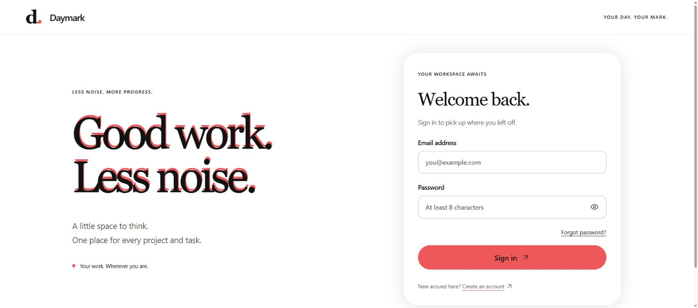
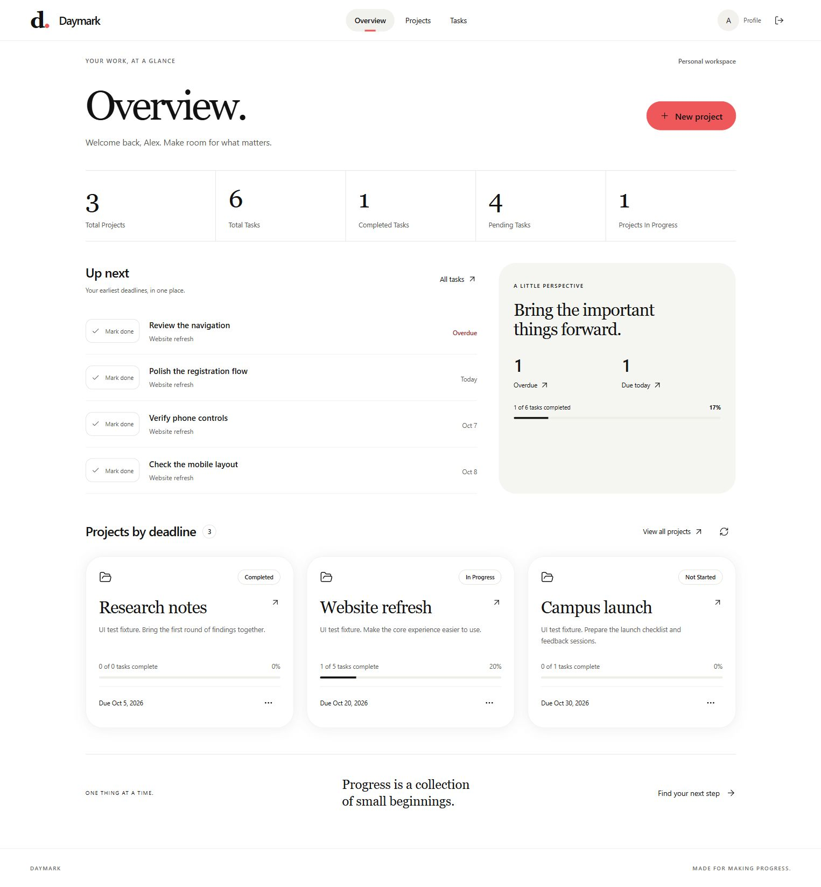
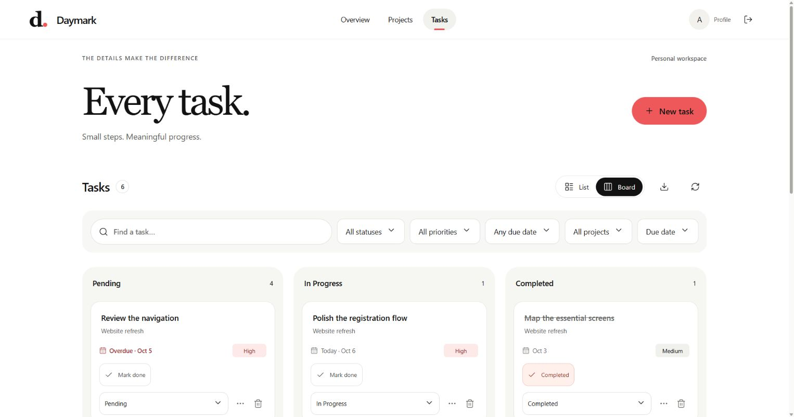
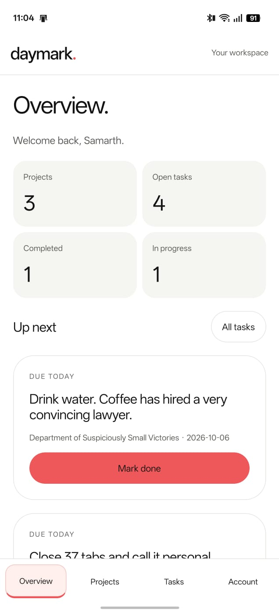
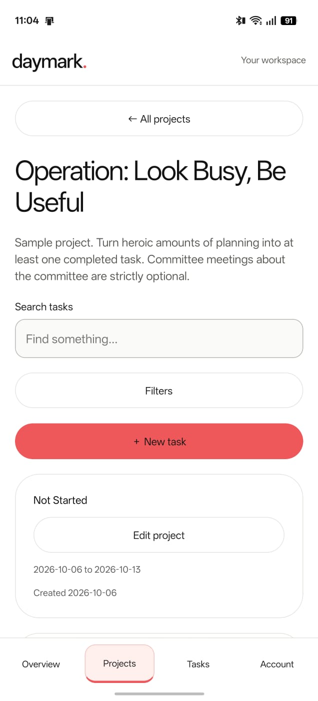
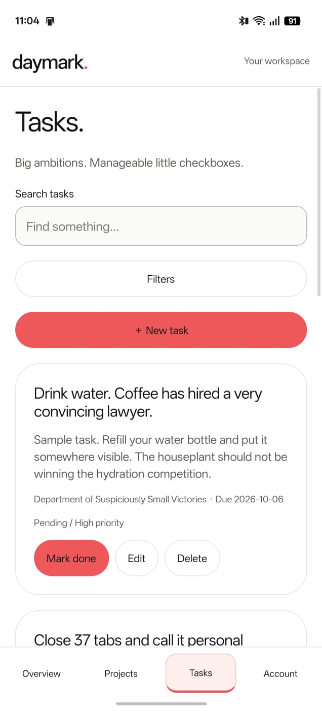
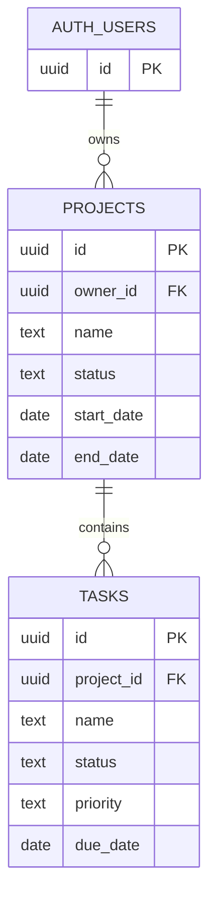

# Daymark

**A little less noise. A little more progress.**

A personal workspace for projects, tasks, and deadlines. Built with Next.js, Expo Go, Express, and Supabase. Typography and motion follow Minimal Type Gallery and Taste Skill.

[Open Daymark](https://daymark-by-sammy.vercel.app) · [Source](https://github.com/sammy-ryed/daymark) · [Design](docs/DESIGN.md) · [Verification](docs/VERIFICATION.md)



## Your work, at a glance

See projects, pending work, upcoming deadlines, and progress without opening every project. Switch between a task list and a board, filter the work that matters, and use **Mark done** to finish a task.



## Made for the details

- Create, edit, and delete projects and tasks with validation and deletion warnings.
- Organize tasks by status, priority, project, and deadline. Search, sort, and export the current view as CSV.
- Switch between list and board layouts; your layout preference is remembered.
- Use themed dropdowns with keyboard navigation and a calendar with Today, Tomorrow, and In a week shortcuts.
- Keep Save within reach in scrollable mobile forms.
- Confirm before discarding unsaved project, task, or profile edits. Keep editing preserves the draft.
- Edit your display name, inspect your account email, and request a password reset.
- See task status changes immediately. Failed saves restore the previous state.
- Navigate with visible focus, accessible labels, and shortcuts: **Alt + N** creates, **Alt + K** searches.
- Use a responsive layout with rem dimensions and a reduced-motion fallback.



These web screenshots show the actual application. The overview and board use an isolated sample workspace for documentation.

## In your pocket

The Expo Go companion shares your account, projects, and tasks with the website. These are unedited captures from a physical Android phone, supplied by the project owner on 6 October 2026. The example projects and tasks were created explicitly for the demo.

<p align="center">
  
  
  
</p>

**Overview · Project details · Tasks**

Native forms include date pickers, full-screen selection sheets, password visibility, keyboard-aware scrolling, and unsaved-change prompts. Task completion updates immediately, with rollback if the request fails. A little clean humor keeps the sample workspace human: even closing 37 browser tabs counts as progress.

| Capability | Web | Expo Go |
| --- | --- | --- |
| Overview, project details, task search and filters | Yes | Yes |
| Create and edit projects | Yes | Yes |
| Delete projects | Yes | Not yet |
| Create, edit, complete and delete tasks | Yes | Yes |
| Edit profile and guard unsaved edits | Yes | Yes |
| Password recovery | Web flow | Opens the web flow |
| Task board, sorting and CSV export | Yes | Not yet |
| Keyboard shortcuts | Alt + N / Alt + K | Not applicable |

## Live deployment

[Website](https://daymark-by-sammy.vercel.app) · [API health](https://daymark-by-sammy.vercel.app/api/health) · [GitHub Actions](https://github.com/sammy-ryed/daymark/actions)

API base URL: `https://daymark-by-sammy.vercel.app/api`.

Vercel builds `apps/web` from GitHub `main`. Next.js serves Express through `/api/[...path]`, keeping browser cookies on the same origin. Functions run in Mumbai (`bom1`), near Supabase. Static assets use platform caching; private API responses use `Cache-Control: no-store`.

**Authentication email uses custom Gmail SMTP.** Supabase sends through `smtp.gmail.com:465` with the display name Daymark. A password-reset request from the deployed app reached the owner's inbox on 6 October 2026. The app password is stored only in Supabase, never in the repository or client. Email confirmation remains enabled. This free setup suits a small demo; Gmail sending limits and Supabase's warning about personal SMTP deliverability still apply. Use a dedicated transactional provider with a verified domain before a larger public launch. Signup confirmation delivery and the final password-change step have not yet been verified end to end. See [Supabase SMTP configuration](https://supabase.com/docs/guides/auth/auth-smtp).

## Run locally

Use Node.js 22.12+ or Node.js 24 and npm.

```sh
npm ci
cp apps/web/.env.example apps/web/.env.local
cp apps/api/.env.example apps/api/.env
npm run dev
```

Set the Supabase URL and publishable key in both environment files. Set `WEB_ORIGIN=http://localhost:3000`. Open http://localhost:3000. The web app includes its same-origin API; the standalone API on port 4000 remains available for mobile development. Set `API_ORIGIN` only if you want the web app to proxy a separate Express server.

On this Windows workspace, source stays at `C:\Users\lenovo\Desktop\project` while dependencies and caches live on D:

```powershell
powershell -File scripts/install-dependencies.ps1
```

Use this installer instead of reinstalling over the `node_modules` junction. Keep `.next` on C: and stop the dev server before building. The launcher preserves module paths across the junction. React is pinned consistently across workspaces to avoid duplicate server-renderer runtimes.

## Expo Go

Keep your computer and phone on the same Wi-Fi. Start Metro from the repository root:

```sh
cp apps/mobile/.env.example apps/mobile/.env
npm run start -w @project/mobile -- --go --lan
```

Set `EXPO_PUBLIC_API_URL=https://daymark-by-sammy.vercel.app/api` to use the hosted API. Alternatively, use `http://YOUR_COMPUTER_LAN_IP:4000/api` with the local API running. `localhost` on a phone points to the phone, not your computer.

Open Expo Go compatible with SDK 57 and scan the QR code printed by Metro. Keep Metro running. The QR code is generated for your current network, so there is no permanent QR code in this README. This setup uses local Wi-Fi, with no public tunnel.

If changes appear stale, stop Metro and restart with:

```sh
npm run start -w @project/mobile -- --go --lan --clear
```

Restart after changing environment variables. For connection failures, check that both devices share the network and Windows allows Node.js on your private network. If Metro advertises the wrong adapter, set `REACT_NATIVE_PACKAGER_HOSTNAME` to the computer's current LAN address in `apps/mobile/.env.local`. The native entry explicitly resolves `./app` to support dependencies on a separate drive.

Physical Android captures confirm the updated app renders live workspace data. Full keyboard, accessibility, session-expiry and iOS testing remain open. No distributable APK is included.

## Repository map

| Path | Responsibility |
| --- | --- |
| `apps/web` | Next.js website and same-origin API adapter |
| `apps/mobile` | Expo Router screens and native controls |
| `apps/api` | Express authentication, validation and data routes |
| `packages/contracts` | Shared validation and types |
| `packages/api-client` | Shared API client |
| `supabase/migrations` | Database schema and ownership policies |
| `scripts` | Local setup and database verification helpers |
| `docs` | Design decisions, verification evidence and screenshots |

## Supabase and authentication

For a fresh project, apply the SQL files in `supabase/migrations` in order. They create owner-isolating row-level policies, validation constraints, and a security-invoker dashboard function. The existing project already has these migrations applied through SQL Editor; its CLI migration history has not been synchronized. Do not reapply them blindly.

The application uses a publishable key plus the signed-in user's JWT. It never uses a service-role key. Never commit environment files or tokens.

Supabase Authentication URL Configuration:

- Site URL: `https://daymark-by-sammy.vercel.app`
- Redirect URL: `https://daymark-by-sammy.vercel.app/reset-password`
- Add `http://localhost:3000/reset-password` only when testing recovery locally.

Web access and refresh tokens use HttpOnly, SameSite cookies with Secure enabled in production. Expired web access tokens refresh on the next request. Recovery removes tokens from the URL fragment immediately, validates them server-side, and requests global session sign-out after resetting the password. Already issued access JWTs can remain valid until expiry. Mobile stores its access token in Expo SecureStore and asks for sign-in again at expiry.

## Performance and security

- One workspace request replaces the old profile-to-three-request loading sequence. Independent database reads run in parallel.
- Web React Query retains private data in memory with a 60-second freshness window. Logout clears it. Mobile keeps workspace data in memory, skips foreground reloads for 60 seconds and displays long lists in batches of 30. Private workspace data is not persisted in localStorage.
- Status changes are optimistic, with rollback on failure and background reconciliation.
- Workspace reads page through PostgREST results to avoid silent row truncation. Search remains client-side; very large workspaces need server pagination and virtualized lists before scale testing.
- Schemas validate every mutation. Supabase RLS enforces ownership independently of the UI.
- Cookie writes require the trusted origin and a custom header. Native clients use bearer tokens.
- Auth limits skip read-only requests. Vercel's trusted proxy supplies client IPs. The application limiter is instance-local; Supabase Auth limits also apply.
- Security headers, bounded JSON bodies, sanitized errors, and request IDs are included. Logs omit bodies and credentials.

## Checks

```sh
npm run typecheck
npm test
npm run build
npm audit --omit=dev --workspace @project/web --workspace @project/api
```

GitHub Actions checks web/API changes on pushes and pull requests. Vercel performs its own production build. On 6 October 2026, all 22 tests passed, TypeScript passed across web/API/mobile, the deployment was ready, and the web/API production audit reported zero vulnerabilities. The Expo tree still has upstream advisories. See [verification details and limits](docs/VERIFICATION.md).

## API reference

Routes use the `/api` prefix and JSON. Web writes send `X-Project-Client: web` and the configured Origin. Mobile sends `X-Project-Client: mobile` and `Authorization: Bearer <token>` after login.

| Route | Purpose |
| --- | --- |
| POST `/auth/register` | Register with `{fullName,email,password}` |
| POST `/auth/login` | Sign in with `{email,password}` |
| POST `/auth/logout` | Revoke the current refresh session and clear cookies |
| GET `/auth/me` | Read the safe profile |
| PATCH `/auth/profile` | Update `{fullName}` |
| POST `/auth/forgot-password` | Request recovery with `{email}` |
| POST `/auth/reset-password` | Validate recovery tokens and change password |
| GET `/workspace` | Profile, projects, tasks, and dashboard together |
| GET, POST `/projects` | List or create projects |
| GET, PUT, DELETE `/projects/:id` | Read, update, or delete an owned project |
| GET, POST `/tasks` | List or create tasks |
| GET, PUT, DELETE `/tasks/:id` | Read, update, or delete an owned task |
| GET `/dashboard` | Five owner-scoped counts |
| GET `/health` | Process status and configuration availability |

Project statuses: Not Started, In Progress, Completed. Task statuses: Pending, In Progress, Completed. Priorities: Low, Medium, High. Dates: `YYYY-MM-DD`. Validation contracts live in `packages/contracts`.


